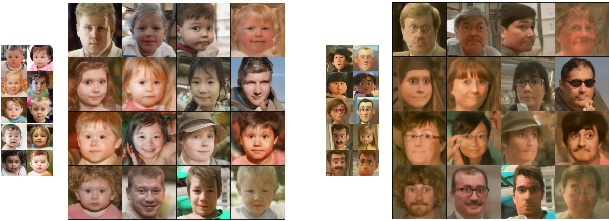

# WeditGAN-pytorch
An unofficial implementation of **WeditGAN: Few-shot Image Generation via Latent Space Relocation** (Duan et al., arxiv 2023)

(Incomplete implementation)

[[paper]](https://arxiv.org/abs/2305.06671)



## Requirements
* Python 3.8 and PyTorch 1.11.0. See https://pytorch.org/ for PyTorch install instructions.
* CUDA toolkit 11.0 or later.
* Ubuntu 18.04

## Getting Started

Pretrained StyleGAN2 stored as `*.pkl` files that can be referenced on [this page](https://nvlabs-fi-cdn.nvidia.com/stylegan2-ada-pytorch/pretrained/). Select one to download and move to `./checkpoints`.

Experiments in this code only used `ffhq70k-paper256-ada-bcr.pkl`, the download link is in [here](https://nvlabs-fi-cdn.nvidia.com/stylegan2-ada-pytorch/pretrained/paper-fig7c-training-set-sweeps/ffhq70k-paper256-ada-bcr.pkl)


You can fine-tune the generator on a few-shot dataset following these steps:

### Preparing dataset

This repository provides 3 preprocessed (10-shot) datasets (resolution 256x256) and placed in `./datasets`:
* pixar
* babies

If you desire fine-tuning on your customized datasets, please preprocessing them (face align) in advance. Place them in a folder `[folder_name]` and move to `./datasets` suggestively.

And then, run the following command to create ZIP archive:
```shell
python ./dataset_tool.py --source=./datasets/[folder_name] --dest=./datasets/[folder_name].zip \ 
    --height=[256|512|1024] --width=[256|512|1024]
```

For example, 
```shell
python ./dataset_tool.py --source=./datasets/babies/aligned --dest=./datasets/babies.zip --height=256 --width=256
```

### Fine-tuning the generator
Run the following command to start training, configure the parameters according to your specific situation.
```shell
python wedit_train.py --network=[CHECKPOINTS PATH] --data=[DATA PATH] --output_dir=[OUTPUT PATH] --resolution=256
```

For example, 
```shell
python wedit_train.py --network=./checkpoints/ffhq70k-paper256-ada-bcr.pkl \ 
    --data=./datasets/babies.zip --output_dir=./outputs/BB --resolution=256
```


### Test on your trained model
Run the following command to generate images using your trained generator.
```shell
python wedit_test.py --network=[CHECKPOINTS PATH] --ft_network=[FTNETWORK PATH] \
    --dw=[dw PATH] --output=[OUTPUT PATH] --num=[NUM] --resolution=[256|512|1024] --seed=[SEED]
```

For example, 
```shell
python wedit_test.py --network=./checkpoints/ffhq70k-paper256-ada-bcr.pkl --ft_network=./outputs/BB/network-snapshot-000030.pkl \
    --dw=./outputs/BB/network-snapshot-000030-w.pkl --output=./outputs/BB --num=16 --resolution=256 --seed=2023
```

## Acknowledgements
Code is based on NVlabs's [stylegan2-ada-pytorch](https://github.com/NVlabs/stylegan2-ada-pytorch)

@author Zichong Chen